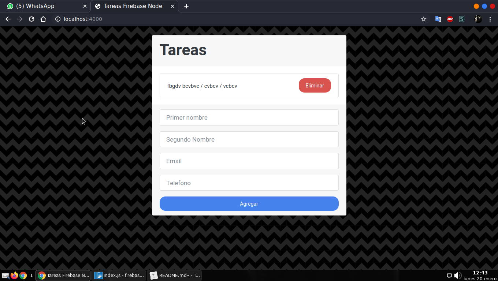

# Practica node.js con firebase

##### Requisitos

1. Tener instalado node y npm(manejador de paquete de node)

Para iniciar ejecuta el siguiente comando estando en tu consola dentro de la carpeta:

`npm install`

 

# Notas

Aqui me explicare de manera breve mas o menos como funciona un proyecto de node, puede variar segun el proyecto, en este dentro de la carpeta src ahi otras 3 directorios mas, que son public, routes y views, la capeta publica vas archivos que todo pueden acceder se le llaman tambien archivos staticos, la carpeta routes a mi parecer y hasta ahora la mas importante ya que aqui se pondra los archivos o en este caso el archivo de configuracion para las rutas y las peticiones que le hagan al servidor para poder hacer una accion segun sea el caso , en este archivo va la coneccion a la base de datos y tambien las 'consultas' a ella, en general todo lo quie tenga que ver con rutas , estaticas o dinamicas. Por ultimo la carpeta views que son las los html como tal que lo raro es el .hbs que hace referencia a handbags que es un motor de plantillas, esto significa que es una especie de html con super poderes xd, con este motor se le pueden agregar funciones como conficionales o ciclos aun que este motor no es a lo que le tienen que poner importancia, en esta misma carpeta esta otra llamada layouts , los archivos layouts son partes de la pagina o sitio web que siempre se repeti en todas las paginas del sitio por ejemplo la barra de navegacion o el footer etc.

# Recursos

- https://www.bootstrapcdn.com/bootswatch/

